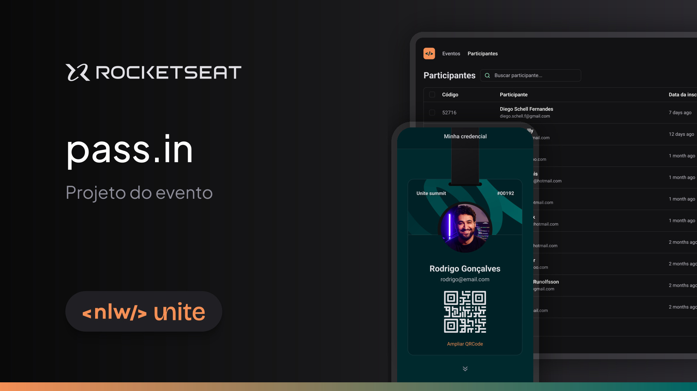

<h1 align="center" id="title">NLW UNITE</h1>

A project crafted during Rocketseat's NLW (Next Level Week) implemented in React JS. This platform enables clients to perform check-ins facilitating search functionality through keywords and seamless navigation across pages.

<h2>Project Screenshots:</h2>

  
  
<h2>💻 Built with</h2>

Technologies used in the project:

*   ReactJS
*   Tailwind CSS
*   JavaScript
*   FakerJS
*   API
*   dayjs
*   lucide-react
*   vitejs
